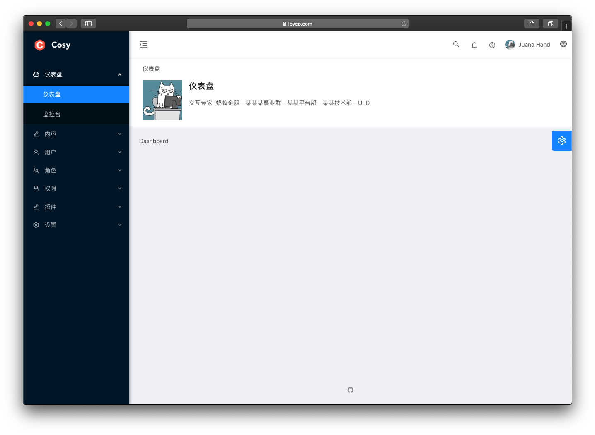

# cosy

[](https://travis-ci.com/loyep/cosy)
[](https://github.styleci.io/repos/175727773)
[](https://packagist.org/packages/loyep/cosy)
[](https://packagist.org/packages/loyep/cosy)
[](https://packagist.org/packages/loyep/cosy)
[](https://packagist.org/packages/loyep/cosy)

> A Laravel-Vue Website.



## Features

- Laravel 5.8 
- Vue + VueRouter + Vuex + VueI18n + ESlint
- Pages with dynamic import and custom layouts
- Login, register and password reset
- Socialite integration

## Installation

- `composer create-project --prefer-dist loyep/cosy cosy`
- Edit `.env` and set your database connection details
- (When installed via git clone or download, run `php artisan key:generate` and `php artisan cosy:install`)
- `php artisan migrate --seed`
- `npm install`

## Usage

#### Development

```bash
# watch
npm run watch

# dev
npm run dev
```

#### Production

```bash
npm run prod
```

## Changelog

Please see [CHANGELOG](CHANGELOG.md) for more information what has changed recently.


## License

cosy is released under an MIT license. See [License](LICENSE) for more information.